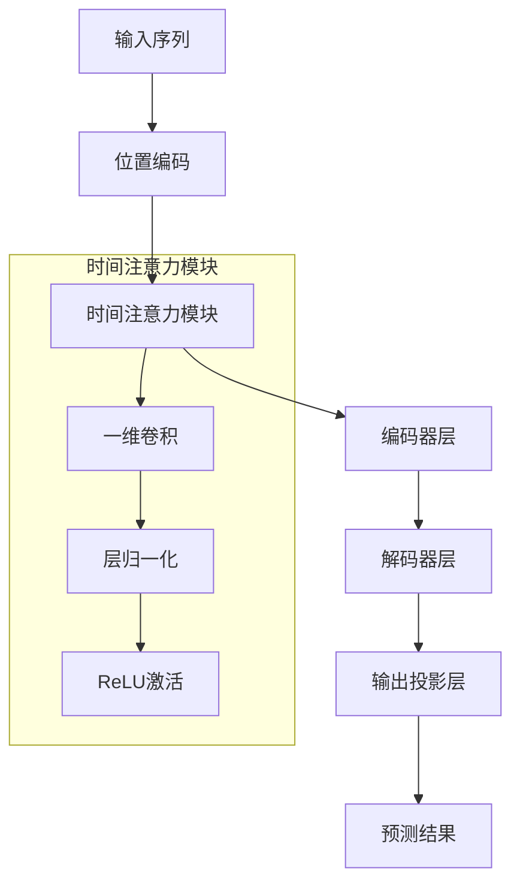
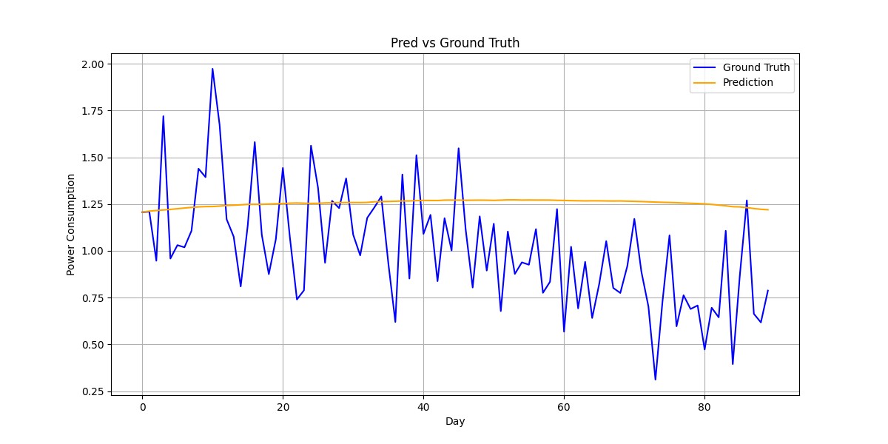

# 增强型时间序列预测Transformer模型

## 概述
本项目通过引入新型时间注意力模块和优化训练策略，对传统Transformer架构进行了增强，专门针对时间序列预测任务。改进重点包括捕捉局部时间依赖性、提升训练稳定性，以及优化长序列预测（最长365天）性能。

## 核心创新点

### 1. 时间注意力模块（TemporalAttention）
- **架构**：基于卷积的注意力机制，捕捉局部时间依赖关系
- **核心组件**：
  - 一维卷积层
  - 层归一化（LayerNorm）
  - ReLU激活函数
- **设计目的**：解决原始Transformer全局注意力机制在时间序列数据上的局限性，有效捕捉短期波动和局部模式
- **优势**：显著提升长序列预测任务的性能表现

### 2. 优化训练策略
- **AdamW优化器**：替代SGD，加入权重衰减（0.01）提升收敛性和正则化效果
- **学习率调度**：
  - 预热阶段（Warmup）后接指数衰减
  - 最低学习率=初始学习率的10%
- **梯度裁剪**：设置max_norm=1.0稳定训练过程
- **优势**：加速模型收敛，提高训练稳定性，增强泛化能力

### 3. 灵活模型变体支持
- 提供两种Transformer配置：
  - `original`：标准Transformer架构
  - `enhanced`：集成时间注意力模块的增强版
- 便于不同变体间的性能对比实验

### 4. 增强正则化机制
- 显式Dropout层（比例=0.1）防止过拟合
- 输出层前添加额外LayerNorm
- **优势**：提升模型抗干扰能力，有效降低过拟合风险

## 模型架构


## 使用说明

### 训练参数配置
通过命令行参数配置训练：

| 参数             | 选项                                | 默认值           | 说明                     |
|------------------|-------------------------------------|-----------------|--------------------------|
| `--model_type`   | `lstm`, `transformer`, `new_transformer` | `new_transformer` | 选择模型架构             |
| `--long_term`    | 标志位（无需值）                    | False           | 启用365天长序列预测模式  |

### 训练命令示例
1. 训练增强版Transformer（90天预测）：
```bash
python main.py --model_type new_transformer
```

2. 训练增强版Transformer（365天长预测）：
```bash
python main.py --model_type new_transformer --long_term
```

3. 训练原始Transformer：
```bash
python main.py --model_type transformer
```

4. 训练LSTM基准模型：
```bash
python main.py --model_type lstm
```


### 预测可视化

*LSTM预测结果与实际值对比*

*LSTM预测结果与实际值对比*

*增强版Transformer预测结果展示精度提升*

## 文件结构
```
├── assets/                  # 可视化图表
│   ├── prediction_vs_truth_lstm.png
│   └── prediction_vs_truth_new_transformer.png
├── models/
│   ├── lstm.py              # LSTM实现
│   └── new_transformer.py   # 增强Transformer实现
├── power_dataset.py         # 数据加载与预处理
├── train_eval.py            # 训练与评估函数
└── main.py                  # 主训练脚本
```

## 依赖环境
- Python 3.8+
- PyTorch 1.12+
- NumPy
- pandas
- Matplotlib
- scikit-learn